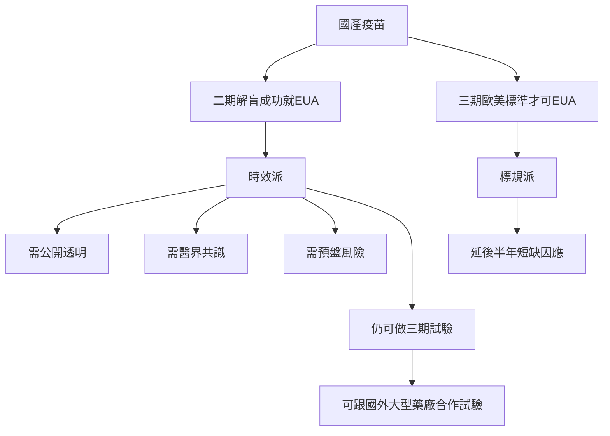

# TestMD

### [架構圖](https://hackmd.io/@docs/mermaid_graphTD)


```mermaid
graph TD
A[总经理] -->|A1| B(XX副总)
B --> C[XX部]
B --> D[XX部]
B --> E[XX部]
C--> G[模块4]
C--> H[模块5]
C--> J[模块6]
D--> K[模块K]
E--> L[模块1]
E--> Z[模块2]
E--> X[模块3]
